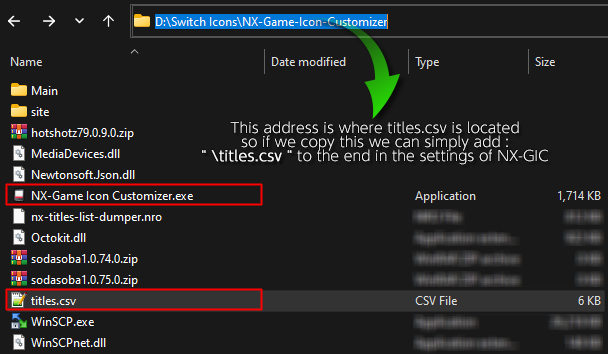

??? Question "NX Titles List Dumper :fontawesome-solid-file-csv:"

are you getting Errors importing titles.csv?
lets see if we can fix that.

In NX-GIC go to `File > Settings`

[]{Settings|info}

if you have something in the [`Installed Titles List (CSV)`]{if delete is clickable|rounded|info} path click [Delete]{delete|bottom|rounded|error}.

then click [{==SAVE==}]{SAVE|right|rounded|success}

??? Bug "Possible Bug"
	I recommend closing nx-gic and reopening it, this seems to be better at refreshing the changes made
	I'm not sure if this is a database issue or how nxgic saves changes made to the program

If you have followed by guide you should have titles.csv in the same folder as nx-gic 
copy the path ++ctrl+c++

[]{Copy the Address Bar|info}

once again open NX-GIC go to `File > Settings`

and paste ++ctrl+v++ the nx-gic location we have just copied into [`Installed Titles List (CSV)`]{D:\Switch Icons\NX-Game-Icon-Customizer\titles.csv|bottom|rounded|error}
??? Bug "Possible Bug"
	I recommend closing nx-gic and reopening it, this seems to be better at refreshing the changes made
	I'm not sure if this is a database issue or how nxgic saves changes made to the program
	

To Reload titles.csv Click on Auto GIC
Hit Ok and locate the titles.csv file

click open and titles installed should work correctly

??? Bug "Possible Bug"
	I've noticed errors where nx-gic fails to load the csv correctly and can possibly delete the CSV file from your system
	so either have a backup or recopy the file from your SD card.